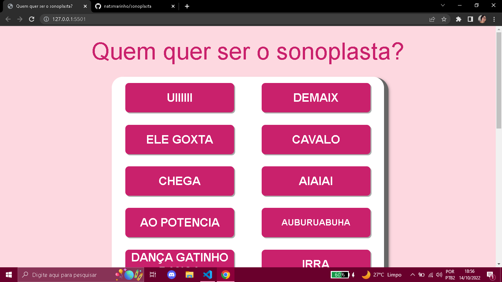

<h1 align='center'>SONOPLASTA</h1> 

<p align="center">
   
</p>

> Status do Projeto: :heavy_check_mark: concluído
## Deploy: https://natsmarinho.github.io/sonoplasta/

## Table of contents

- [Overview](#overview)
  - The challenge is to build out this interactive sound design's page component.
- My process: It took me 5 days to build this.
  - Built with: HTML5, CSS3 and JAVASCRIPT.
  - What I learned: I've learned how to use display grid and how to manipulate DOM. And also I've learned more how to built a responsive page.
  - Continued development: I have to continue practice how to use the responsive page and javascript. 
- Author: Natali Marinho. 
- Acknowledgments: javascript, css and html.


### The challenge

Users should be able to:

- View the optimal layout for the app depending on their device's screen size;
- Select a button and it has to make a sound;

### Screenshot




### Built with

- Semantic HTML5 markup
- CSS custom properties
- CSS Grid
- Mobile-first workflow
- Javascript


### What I learned


```js
 tecla.onkeydown = function(evento){
        if(evento.code === 'Enter' || evento.code === 'Space'){
            tecla.classList.add('ativa');
        };
    };

    tecla.onkeyup = function(evento){
        tecla.classList.remove('ativa');
    };
```

### Useful resources

- [File with the sounds](https://www.youtube.com/watch?v=w2xFUfwlAME) - This helped me for the sounds of the website.

## Author

- Frontend Mentor - [@natsmarinho](https://www.frontendmentor.io/profile/natsmarinho)
- Twitter - [@natsmarinho](https://www.twitter.com/natsmarinho)
- Instagram - [@natsmarinho](https://www.instagram.com/natsmarinho/)
- Linkedin - [@natsmarinho](https://www.linkedin.com/in/natsmarinho)

## Acknowledgments

I would like to thank to syphazk [on youtube](https://www.youtube.com/channel/UC3VCZIy_8AAnR9cj1kzFfdQ) for making a file with the sounds avaliable. 

# Nome do meu projeto

Rápida descrição do objetivo de fazer esse projeto

| :placard: Vitrine.Dev |     |
| -------------  | --- |
| :sparkles: Nome        | **Quem quer ser o sonoplasta?**
| :label: Tecnologias | javascript, html, css
| :rocket: URL         | https://natsmarinho.github.io/sonoplasta/


## Detalhes do projeto

Projeto inspirado no aluraMid com os áudios do programa 'Vai dar namoro'.
